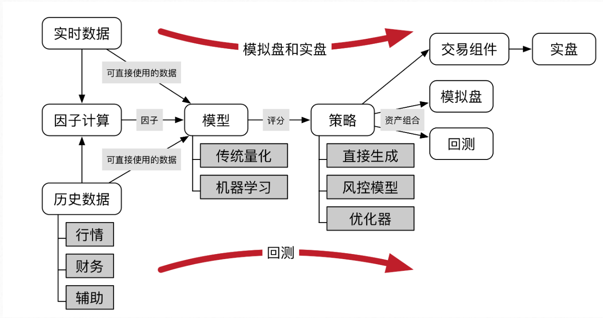

# Quantitive Analysis

Stock market model


### Question

```mark
1. efficient market hypthesis
2. Fama-French 三因子模型
3. fundamental analysis 基本面分析与 techqnical analysis 技术面分析, 将基本面中的信息放入量化投资的框架中进行研究
4. Modern portfolio theory
5. Capital Asset Pricing Mode
6. Factor Model
7. arbitrage and arbitrage pricing theory
8. 投资策略：数据+量化模型
9. 
```
## Quantitive Trading System
a complext area of quant finance, MATLAB, R, Python, **C/C++** 

The **skills** required by a sophisticated quantitative trading researcher are diverse. An extensive background in mathematics, probability and statistical testing provide the quantitative base on which to build. An understanding of the components of quantitative trading is essential, including forecasting, signal generation, backtesting, data cleansing, portfolio management and execution methods. More advanced knowledge is required for time series analysis, statistical/machine learning (including non-linear methods), optimisation and exchange/market microstructure. Coupled with this is a good knowledge of programming, including how to take academic models and implement them rapidly.
## Taiwan Stock三大法人
- 自营商
- 投信
- 外資

### 自营商
1. Dealers (Proprietary) 自营商（自行买卖）
2. Dealers (Hedge) 自营商（避险)

### 投信
1. Securities Investment Trust Companies 投信

### 外資
1. Foreign Investors include Mainland Area Investors (Foreign Dealers excluded) 外资及陆资不包含外资自营商
2. Foreign Dealers 外资自营商

### example
1. percentage of 三大法人: [三大法人买卖金额统计表](https://www.twse.com.tw/zh/page/trading/fund/BFI82U.html)


| 16/08        | 买进金额        | 卖出金额        |
| :--         |     :---:      |          ---: |
| 自营商         | 5,436,677,911(15.1%)     | 5,159,068,904(11.2%)    |
| 投信          | 1,415,994,587(3.9%)       | 1,529,144,400(3.3%)      |
| 外资           | 29,214,513,306(81.0%)       | 39,547,867,502(85.5%)      |
| 合计                  | 36,062,400,444	       | 46,228,432,636      |


| 16/08        | 买进金额        | 卖出金额        |
| :------          |     :---:        |          ---: |
| 自營商(自行買賣) | 1,245,015,007(3.5%)  | 1,305,505,016(2.8%)|
| 自營商(避險)     | 4,191,662,904(11.6%)| 3,853,563,888(8.4%)|
| 投信            |1,415,994,587(3.9%)| 1,529,144,400(3.3%)  |
| 外資及陸資(不含外資自營商)| 29,209,727,946(81.0%)|39,540,219,332(85.5%)    |
| 外資自營商       | 4,785,360(0.01%)       | 7,648,170(0.01%)|
| 合计            | 36,062,400,444	| 46,228,432,636      |


